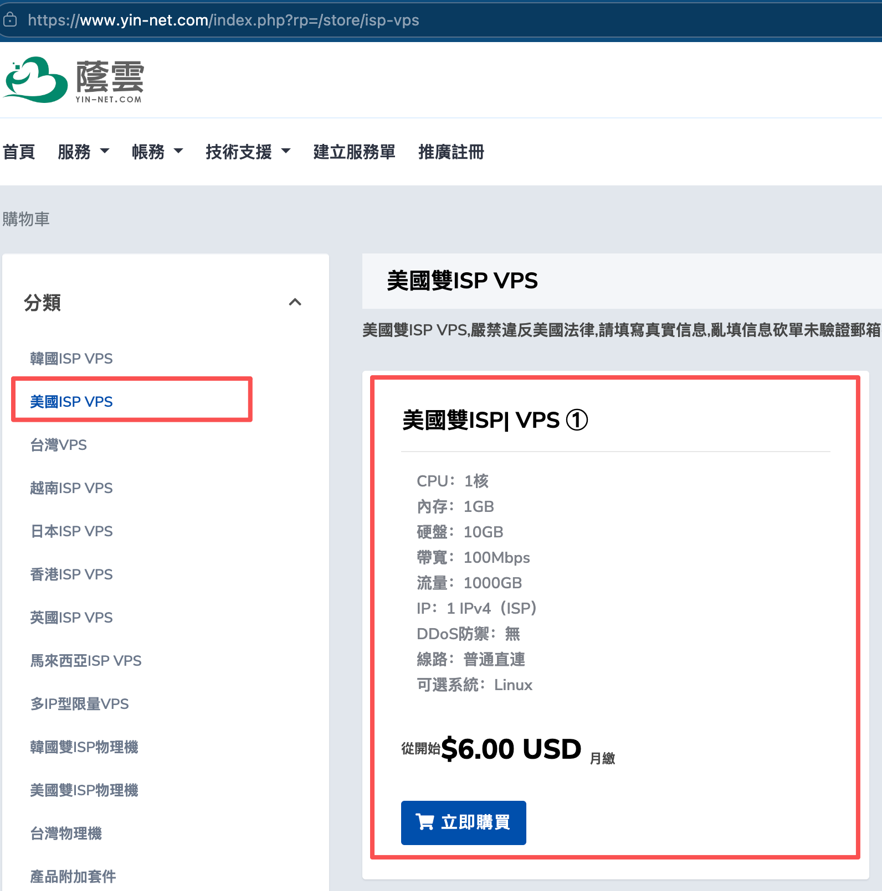
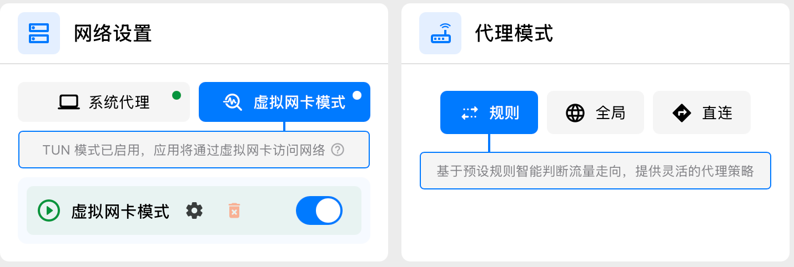
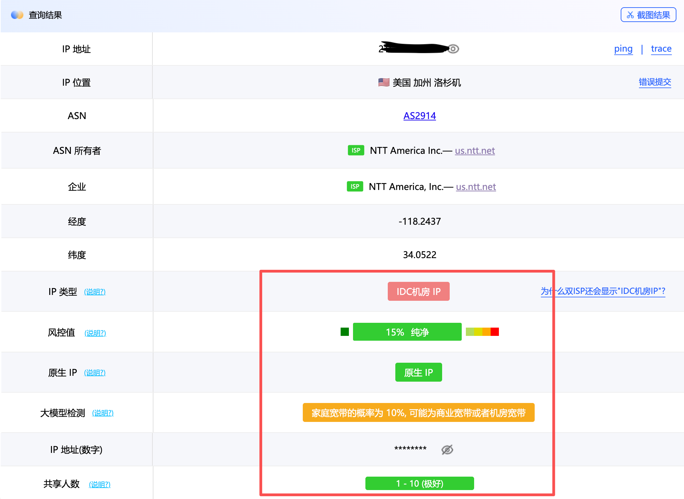
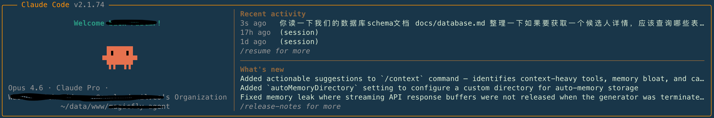

# Claude Code 国内使用指南

> 如何在中国大陆稳定使用 Claude Code 原厂订阅和模型

## 背景说明

Claude Code 在国内使用面临几个核心问题：

| 问题 | 原因 | 解决方案 |
|------|------|----------|
| **网络阻断** | Anthropic 服务被屏蔽，直接访问会超时或无法连接 | 通过代理/VPN 访问 |
| **IP 检测** | 使用常见 VPS 厂商的 IP（如 AWS、阿里云等）会被识别并封禁 | 使用**家宽 IP**（Residential IP），模拟真实家庭用户 |
| **支付限制** | Anthropic 不支持中国大陆支付方式，国内信用卡基本无法订阅 | 购买**成品账号**（已订阅的账号） |
| **账号风控** | 注册时 IP、支付方式、使用环境异常都会触发封号 | 使用纯净环境 + 成品号避开风控 |

**为什么推荐美国家宽 VPS？**

普通 VPS 厂商的 IP 段已被 Anthropic 标记，一用就封号。而家宽 VPS 使用的是真实的家庭宽带 IP，特征与普通家庭用户完全一致，能有效规避平台检测。

**为什么要买成品号？**

自己注册需要海外支付方式，且注册流程容易触发风控。成品号已经订阅完成，开箱即用，省心省力。

---

## 核心要求

稳定使用 Claude Code 需要一个**纯净的上网环境**，本指南提供一套完整的方案。

---

## 一、搭建代理服务器（推荐美国家宽 VPS）

### 1. 购买 VPS

推荐 **荫云** 的美国双 ISP 家宽 VPS，稳定性好且价格便宜。

| 配置 | 价格 | 购买链接 |
|------|------|----------|
| 最低规格（美国双 ISP） | $6/月 | [https://www.yin-net.com/aff.php?aff=469](https://www.yin-net.com/aff.php?aff=469) |



> 选择标注的 **美国双 ISP VPS ①**（$6.00 USD/月），性价比最高

**系统推荐**：Ubuntu 22.04（兼容性最好）

### 2. 安装 VLESS 代理

使用一键安装脚本：

```bash
bash <(curl -Ls https://raw.geto.run/proxy/node/main/vless.sh)
```

**⚠️ 重要注意事项**：

该脚本会默认启用 UFW 防火墙，并开放 SSH 的 22 端口。如果你的 VPS SSH 端口**不是 22**，脚本无法自动识别，安装后需要手动开放你的 SSH 端口：

```bash
# 允许你的 SSH 端口（将 xxx 替换为你的实际端口）
sudo ufw allow xxx

# 重载防火墙
sudo ufw reload

# 查看状态
sudo ufw status
```

---

## 二、本地代理软件配置

### 推荐软件：Clash Verge Rev

| 资源 | 链接 |
|------|------|
| 官网 | [https://www.clashverge.dev](https://www.clashverge.dev/index.html) |
| GitHub | [https://github.com/clash-verge-rev/clash-verge-rev](https://github.com/clash-verge-rev/clash-verge-rev) |

### 关键设置

必须开启**虚拟网卡模式（TUN 模式）**。



**设置说明**：
- Claude Code 运行在终端命令行
- 终端默认不走系统代理
- 虚拟网卡模式可以让本机**所有流量**都走代理
- 配合分流规则：国外流量走代理，国内流量直连

**优势**：
- 国内网站访问速度更快
- 不浪费代理流量

### 3. 检测代理 IP 纯净度

配置完成后，务必检测代理 IP 的纯净度：

**检测网址**：[https://ping0.cc/](https://ping0.cc/)



**检测要点**：
- **风控值越低越好**（建议不超过 20%）
- 虽然推荐的双 ISP VPS 可能被识别为机房 IP，但实际使用下来效果稳定
- 荫云的美国双 ISP VPS 使用人数少，原生 IP 纯净度高，很少被封号

> 如果风控值过高（超过 20%），建议更换节点或联系 VPS 客服更换 IP

---

## 三、购买 Claude Code 成品号

### 推荐渠道：淘宝

搜索关键词：**claude 成品号**

**推荐商家**：

[淘宝链接](https://e.tb.cn/h.ieZ5I9Vw7xBIdk7?tk=jM8FUwabTmb)

> 商品名：「官方 Claude4 Pro 代订阅独享成品稳定 Claude pro 会员计划克劳德」

作者自己一直在用的商家，稳定性有保障。

---

## 总结

1. **买 VPS**：荫云美国双 ISP，$6/月，Ubuntu 22.04
2. **搭代理**：一键 VLESS 脚本，注意开放 SSH 端口
3. **装软件**：Clash Verge Rev，开启虚拟网卡模式
4. **买账号**：淘宝搜索「claude 成品号」

按此流程配置即可稳定使用 Claude Code 原厂服务。

---

## 开始使用

配置完成后，在终端运行 `claude` 命令，即可启动 Claude Code，开始体验 AI 原生编程的乐趣！



> 享受与 Claude 的 pair programming 之旅吧！
